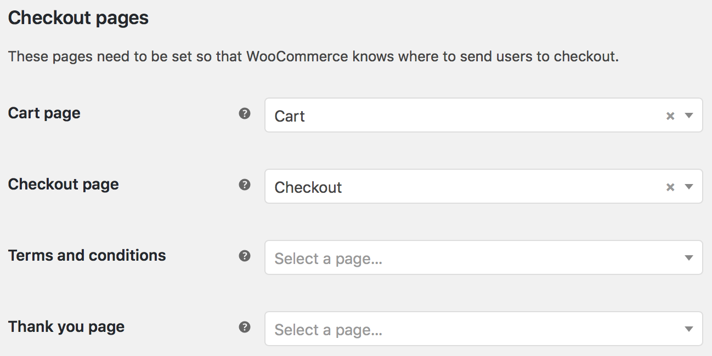
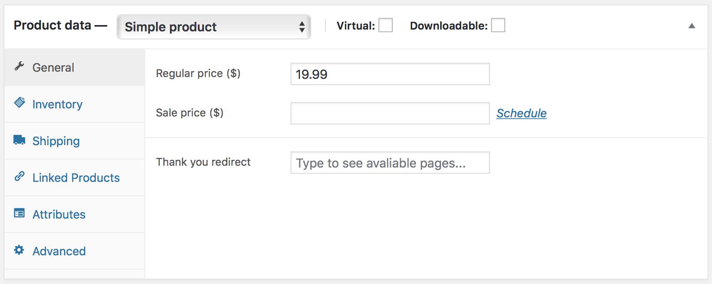
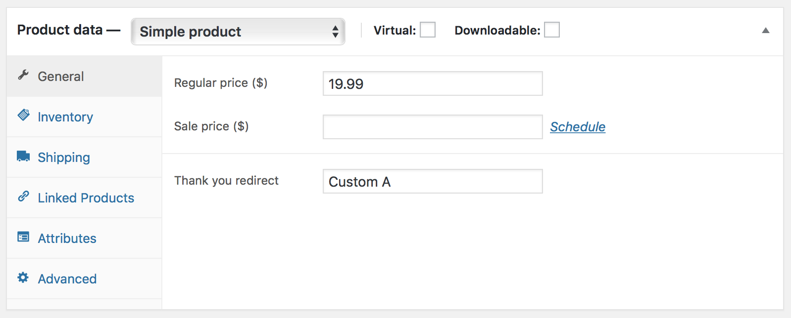
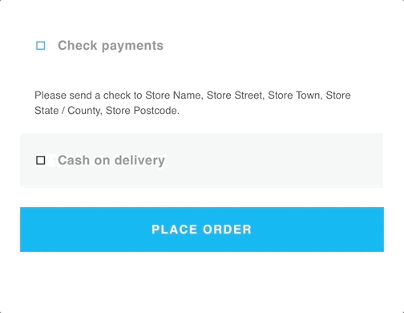
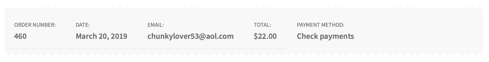
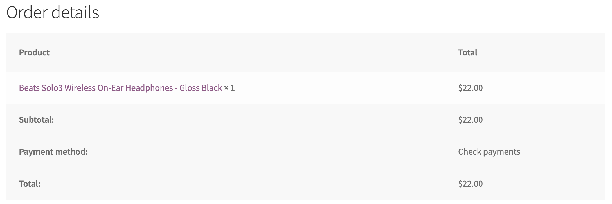

# WooCommerce Custom Thank You

The **WooCommerce Custom Thank You** extension enables you to do the following things:

* Set a global "Thank You" page to redirect customers to after checkout.
* Set a custom "Thank You" page on a per-product basis.

This is handy when you want to:

* Send a customer to a page outlining your fulfillment process.
* Prompt a customer to sign up for you mailing list.
* Give a customer a list of next steps (installation instructions, course reading, etc.) post-purchase.

## Installation

1. Upload the `woocommerce-custom-thank-you` directory into the `/wp-content/plugins/` directory.
2. Activate the plugin through the "Plugins" menu in WordPress.
3. Set a global "Thank You" page under "WooCommerce -> Settings -> General -> General options". (Optional, but suggested)

## Setting a custom "Thank You" page

1. Edit an individual product.
2. In the "Product data — Simple product" meta box, enter a page into the "Thank you redirect" field.
3. Update the product.

## Custom "Thank You" page customizations

Since this plugin overwrites the default WooCommerce thank you page, we have included four shortcodes that you can use to display order details to your customers. They are:

* `[woo_order_details]` — The standard WooCommerce thank you page receipt view
* `[woo_order_stub]` — A short, one line order synopsis containing: order number, order date, customer email, order total, payment method
* `[woo_order_table]` — A table containing: a list of purchased products with prices, order subtotal, shipping cost, payment method, order taxes, order total
* `[woo_customer_details]` — A brief collection of customer details such as: customer name, customer email, billing address

## Notes

* Setting a *global* or *custom* "Thank You" page overrides the normal "Order received" display post-checkout.
* If a customer has multiple products with multiple *custom* thank you pages in their cart, the *global* default is used.

## Screenshots

### Global setting

### Product setting

### Checkout with thank you redirect set

### Shortcodes

#### `[woo_order_stub]`

#### `[woo_order_table]`

##### `[woo_customer_details]`

